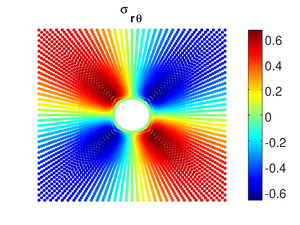

# Binary Classification Model for von Mises Yielding
*Keras neural network binary classification model to approximate von Mises yield criterion*

Launch the Jupyter notebook in Google Colab by clicking on this badge: [](https://colab.research.google.com/github/lbborkowski/binary-classification-vMYield/blob/master/vMBinaryClassification_200726.ipynb)

## Overview
Neural networks are used to approximate unknown underlying functions which map a set of inputs to an output. The universal approximation property of neural networks ensures that a feedforward network containing a sufficient but finite number of neurons can approximate any continuous function. For most practical problems where neural networks are employed (e.g., image classification, object detection, speech recognition), an analytical function for mapping input to output is not known and/or perhaps is too complex for a human to conceptualize. 

In this repository however, a relatively simple (and known) function is approximated using a neural network. This function is the von Mises yield criterion that is used extensively in the field of material plasticity. The yield criterion (Eq. 1) determines when a material like a metal will permanently/plastically deform based on its stress state. Although an expression for the von Mises yield criterion exists, an attempt is made to develop and fit a neural network to approximate this function. The type of model employed is a fully-connected neural network for binary classification. The problem of yielding can be cast as a binary classification problem because the material is either yielding (1) or not yielding (0) where Eq. 1 serves as the boundary separating the two cases.


> *Eq. 1: von Mises yield criterion for general plane stress*

## Baseline analytical model
To validate the accuracy of the model, it is tasked with predicting which locations in a thin plate with a hole will yield when a unidirectional remote stress is applied. This problem is chosen since there is an analytical solution available for the full stress field at every location of the plate. Since the plate is thin, the plane stress assumption can be made. Also, it is assumed that the plate is infinitely wide. Fig. 1 presents the geometry and loading conditions for the plate. 


> *Fig. 1: Plate with a hole geometry and loading condition definitions*

The first step is to discretize the center hole plate into elements and nodes so the stress components at each node can be computed. Meshing is done using the code available [here](http://compmech.lab.asu.edu/data/hole_mesh.m). The nodal positions for a 1 x 1 plate containing a 0.1 radius hole and meshed with 3968 elements are shown in Fig. 2.


> *Fig. 2: Plate with a hole nodal positions*

Once the nodal positions are known, the values of the three stress components in the cylindrical coordinate system (\sigma_{rr}, \sigma_{tt}, \sigma_{rt}) can be computed from the following three equations found [here](https://ocw.mit.edu/courses/mechanical-engineering/2-002-mechanics-and-materials-ii-spring-2004/labs/lab_4_s04.pdf). Contours of the three cylindrical stress components for a remote stress of one (\sigma_0=1) applied to the center hole plate are shown in Fig. 3. Because the stresses vary throughout the plate and are in general highest near the hole, von Mises stress and plastic yielding will vary spatially. 


> *Eq. 2: Stress components for an infinite plate with a central hole under uniaxial tensile loading*

  
> *Fig. 3: Contour plots of stress components for an infinite plate with a central hole under uniaxial tensile loading*

The known stress values at every nodal position can be supplied to the plane stress von Mises yield criterion in cylindrical coordinates shown in Eq. 3. Equation 3 was modified from its usual form by replacing the "equal" sign with a "greater than or equal" sign. This was done since for the example problem, yield is determined in a post-processing sense rather than being coupled with the stress solution. Because of this the redistribution of stress following yielding is not considered along with hardening that would occur in an actual material under such loading. Expressing Eq. 3 as an inequality allows a determination to be made for every node, based on its final stress state, whether yielding will occur or not. Computing the von Mises stress (left side of Eq. 3) across the plate yields the contour shown in Fig. 4. 


> *Eq. 3: von Mises yield criterion in cylindrical coordinates for plane stress*


> *Fig. 4: Contour plot of von Mises stress for an infinite plate with a central hole under uniaxial tensile loading*

The von Mises stress can then be compared with the yield strength and a determination of yielding made. For this example problem, the yield strength is set at 115% of the applied remote load so \sigma_y=1.15. Fig. 5 presents the plate with a hole where yielding occurs for the red nodes and the blue nodes do not experience plastic deformation. The plots of nodal position, stress, and yielding, as well as their corresponding calculations, were created using this [code](/PlateWithHole.m) which can be run in either Matlab or Octave.


> *Fig. 5: Contour plot of yielding for an infinite plate with a central hole under uniaxial tensile loading*

## Binary classification neural network model
For comparison, instead of using Eq. 3 to determine plastic yielding, a neural network was constructed and fit to determine yielding vs. no yielding. To do this, a relatively simple neural network model with a single hidden layer is built. A single layer was chosen based on a limited study demonstrating that the testing accuracy did not appreciably increase for two or more hidden layers. For both the single- and two-hidden layer models, the number of nodes was varied to find where the testing accuracy converged. The plot of this study is shown in Fig. 6 where the number of nodes on the x-axis denotes the number of nodes in each of the hidden neural network layers.  As previously mentioned, it can be observed in this plot that having two hidden layers does not provide significant benefit over the single hidden layer model. Therefore to minimize computational burden, a single hidden layer model was pursued. Also depicted in Fig. 6 is the convergence in testing accuracy as the number of nodes increases. Based on these results, a single layer with 12 nodes was selected for the purpose of approximating the von Mises yield criterion.


> *Fig. 6: Convergence study to determine number of layers and nodes for neural network*

### Training/testing data
As is the case with any neural network model, data is required for training. In the current example, synthetic data was created which spanned all the possible stress values in the plate with a hole example. This was accomplished by finding the minimum and maximum values of each of the three stress components computed in [PlateWithHole.m](/PlateWithHole.m) and creating uniformly distributed random samples of points between these bounds. Extending the range by 1% prior to creating the random distribution of points increased the likelihood that the endpoints would be included. If a sufficient number of samples are taken between the extended bounds of the three stress components, the stress space for the plate with a hole should be fully covered with the training data.

Prior to training the model, the synthetic data was split between training and testing datasets using an 80/20 split. This allowed the accuracy of the two sets of data to be evaluated to determine if overfitting of the training data was occurring. For the study presented in Fig. 6, a total of 100,000 synthetic data points were used for training and testing. For the validation of the model using the plate with a hole example, 500,000 data points were created.

### Keras model description
The neural network model with a single hidden layer containing 12 nodes was built using Keras with a TensorFlow backend. The fully-connected network with three input variables (nodes), one hidden layer with 12 nodes, and a single output node is defined using the few lines below. In the first line, a Sequential model is defined where a linear stack of layers is added in subsequent lines. The second line defines the number of nodes in the single hidden layer (12), the number of input features (3), along with the activation function to employ (ReLU in this case). The final line prescribes a single node for the output layer of the binary classification model. A sigmoid activation function for the output layer is chosen to ensure output between zero and one which can be rounded to either zero or one for the purpose of binary classification. Notice that the hidden and output layers are defined using the Dense class in order to specify a fully connected model architecture.

```python
model = Sequential()
model.add(Dense(12, input_dim=3, activation='relu'))
model.add(Dense(1, activation='sigmoid'))
```

Next, the model is compiled using the following line where the loss function and optimizer are prescribed. In this example the default options in Keras for a binary classification problem are chosen for the loss function (binary cross entropy) and optimizer (adam). In addition, accuracy is chosen as the output metric. 

```python
model.compile(loss='binary_crossentropy', optimizer='adam', metrics=['accuracy'])
```

### Model training
The model was fit using the following line where the variables `sigArr_train` and `yld_train` contain the training stress values and yield classification, respectively. A total of two epochs were used since more iterations were not shown to improve accuracy. Also, a batch size of five was chosen to balance accuracy and computational efficiency. Training the described model with 400,000 data points on a single CPU using [Google Colab](https://colab.research.google.com/notebooks/welcome.ipynb) took less than 2.5 minutes. This yielded a training and testing accuracy of 98.40% and 98.43%, respectively.

```python
model.fit(sigArr_train, yld_train, epochs=2, batch_size=5, verbose=0)
```

### Validation
Once trained, the model could be employed to predict the locations on the plate with a hole where yielding will occur using the following line where the variable `stress_plate` contains the three stress components at every location in the plate as depicted in Fig. 3. This prediction is compared with the ground truth in Fig. 7. It can be seen that good agreement is achieved where the validation accuracy is 96.88%. The nodes which are incorrectly classified are observed on the boundaries of the yielding region. This indicates that the separation between yielding and non-yielding points is not perfectly approximated by the neural network model.

```python
predictions_valid = model.predict_classes(stress_plate)
```


> *Fig. 7: Validation results for plate with hole predictions using neural network model vs. baseline results*

## Conclusion
Overall, the neural network model constructed and fit for the current example performed well at approximating the von Mises yield criterion. It is possible that optimization of the hyperparameters would yield improved results. However since the goal of the presented project was to build a neural network to approximate the von Mises yield criterion, achieving a fully optimized model was not deemed crucial.
